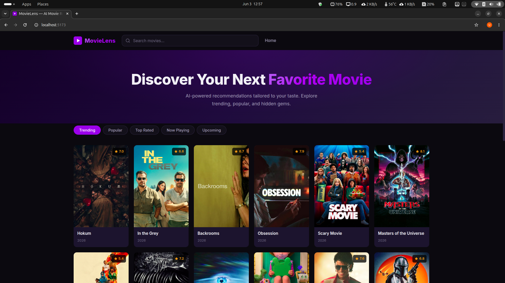

<div align="center">
  <br/>
  
  
  
  
  
  <br/><br/>
  <h1>🎬 Movie Recommendation System</h1>
  <p>
    <strong>Semantic Search · TF-IDF · FAISS · Sentence Transformers · TMDB API</strong>
  </p>
  <p>
    A full-stack movie discovery platform that recommends films based on plot similarity, semantic understanding, genre overlap, and real-time TMDB data.
  </p>
  <br/>
  <p>
    <a href="#-features">Features</a> •
    <a href="#-tech-stack">Tech Stack</a> •
    <a href="#-architecture">Architecture</a> •
    <a href="#-installation">Installation</a> •
    <a href="#-usage">Usage</a> •
    <a href="#-api-reference">API Reference</a>
  </p>
  <br/>
</div>

---

## ✨ Features

| Feature                                 | Description                                                                              |
| --------------------------------------- | ---------------------------------------------------------------------------------------- |
| **🧠 Semantic Search**            | Describe a story or mood — finds movies with matching themes using NLP embeddings        |
| **🔢 TF-IDF Recommendations**     | TF-IDF vectorization + Cosine Similarity on movie overviews with genre overlap boost    |
| **🎭 Genre-Based Discovery**      | Find movies in similar genres using TMDB's discovery API                                 |
| **🔍 Smart Search**               | Real-time search with autocomplete suggestions and debounced TMDB queries                |
| **🏠 Curated Home Feed**          | Trending, Top Rated, Now Playing, Popular, and Upcoming categories                       |
| **🖼️ Rich Movie Details**       | Posters, backdrops, ratings, release dates, genres, and overviews from live TMDB API     |
| **📱 Responsive UI**              | Dark-themed React frontend optimized for desktop, tablet, and mobile                     |
| **⚡ Live TMDB Enrichment**       | Every poster, backdrop, and rating fetched fresh from TMDB via CloudFront                |

---

## 🛠️ Tech Stack

### Frontend

| Technology                      | Purpose                                                  |
| ------------------------------- | -------------------------------------------------------- |
| **React 18**              | UI framework with hooks and functional components        |
| **React Router 6**        | Client-side routing (`/`, `/movie/:id`, `/search`, `/recommend`) |
| **Vite 5**                | Fast dev server and optimized production builds          |
| **CSS Custom Properties** | Dark theme with CSS variables and responsive design      |

### Backend

| Technology               | Purpose                                                  |
| ------------------------ | -------------------------------------------------------- |
| **Python 3.9+**    | Core processing language                                 |
| **FastAPI**        | High-performance async REST API with auto-generated docs |
| **Uvicorn**        | ASGI server for production deployment                    |
| **scikit-learn**   | TF-IDF vectorization and cosine similarity computation   |
| **sentence-transformers** | Semantic text embeddings using `all-MiniLM-L6-v2`  |
| **FAISS**          | Facebook AI Similarity Search — fast approximate nearest neighbor |
| **Pandas / NumPy** | Data manipulation and numerical processing               |
| **httpx**          | Async HTTP client for TMDB API calls                     |
| **Pydantic**       | Request/response validation with type hints              |

### Machine Learning

| Technique                             | Application                                                     |
| ------------------------------------- | --------------------------------------------------------------- |
| **Sentence Transformers**       | `all-MiniLM-L6-v2` model — encodes text into 384-dim embeddings |
| **FAISS**                      | Fast approximate nearest neighbor search over 45K movie vectors |
| **TF-IDF Vectorization**       | Converts movie overviews into numerical feature vectors         |
| **Cosine Similarity**          | Measures pairwise similarity between movie vectors              |
| **NLP Preprocessing**          | Text cleaning, stop word removal, and vocabulary building       |
| **Genre Overlap Boost**        | Adds +0.15 similarity score per shared genre word               |

### Data

| Source                          | Description                                                         |
| ------------------------------- | ------------------------------------------------------------------- |
| **TMDB API (CloudFront)** | Real-time movie metadata, posters, backdrops, search, and discover  |
| **TMDB Image CDN**        | `image.tmdb.org` — serves poster and backdrop images                |
| **Movies Metadata (CSV)** | ~45K movie records from Kaggle for offline TF-IDF computation       |
| **Pickle Files**          | Pre-computed TF-IDF matrix, FAISS index, and embeddings for fast startup |

---

## 🏗️ Architecture

```
  Browser (React)
  +----------+ +----------+ +-------------------+ +-----------+
  | HomePage | |MovieDetail| | SearchResultsPage| |SemanticPage|
  +----+-----+ +----+-----+ +---------+---------+ +-----+-----+
       |           |                   |                 |
  +----v-----------v-------------------v-----------------v------+
  |              movieApi.js (Fetch API)                        |
  |  API_BASE -> https://movie-recommendation-system-6erz.onrender.com |
  +----------------------------+-------------------------------+
                               | HTTPS
  +----------------------------v-------------------------------+
  |              FastAPI Backend (Render)                       |
  |  +------------------------------------------------------+  |
  |  |  REST API Endpoints                                  |  |
  |  |  /home  /movie/id  /movie/search  /tmdb/search      |  |
  |  |  /recommend/story  /recommend/movie                  |  |
  |  |  /recommend/genre  /recommend/tfidf  /health        |  |
  |  +-----------+--------------------+--------------------+  |
  |              |                    |                        |
  |  +-----------v------+  +--------v--------------------+   |
  |  |   TMDB API       |  |  Semantic Module            |   |
  |  |  (api.tmdb.org)  |  |  SentenceTransformers       |   |
  |  |  via CloudFront  |  |  + FAISS index              |   |
  |  +------------------+  +--------+--------------------+   |
  |                                |                          |
  |  +-----------------------------v----------------------+   |
  |  |        Pickle Files (Local Fallback)                |   |
  |  |  df.pkl, tfidf.pkl, indices.pkl, embeddings.npy    |   |
  |  +----------------------------------------------------+   |
  +-----------------------------------------------------------+
```

### Data Flow

1. **Frontend** sends HTTP requests to the FastAPI backend via `movieApi.js`
2. **TMDB routes** (`/home`, `/movie/id`, `/tmdb/search`) query the live TMDB API for fresh data
3. **TF-IDF routes** (`/recommend/tfidf`) use local pickle files for content-based similarity
4. **Semantic route** (`/recommend/story`) encodes the user's story/mood with Sentence Transformers, then searches the FAISS index for nearest neighbors
5. **All results** are enriched with live TMDB metadata (posters, backdrops, ratings, release dates)
6. **Images** are served from TMDB's CDN (`image.tmdb.org`)

---

## 📦 Installation

### Prerequisites

- Python 3.9+
- Node.js 18+
- npm 9+
- TMDB API key ([get one free](https://www.themoviedb.org/settings/api))

### 1. Clone the Repository

```bash
git clone https://github.com/Ujjval009/Movie_Recommendation_System.git
cd Movie_Recommendation_System
```

### 2. Backend Setup

```bash
# Create virtual environment
python -m venv venv
source venv/bin/activate   # Linux/Mac
# venv\Scripts\activate    # Windows

# Install dependencies
pip install -r requirements.txt

# Create .env file with your TMDB API key
echo "TMDB_API_KEY=your_api_key_here" > .env
```

### 3. Frontend Setup

```bash
cd frontend
npm install
cd ..
```

### 4. Data Files

The project expects these pickle files in the root directory:

- `df.pkl` — DataFrame with movie data
- `indices.pkl` — Title-to-index mapping
- `tfidf_matrix.pkl` — Pre-computed TF-IDF matrix
- `tfidf.pkl` — Fitted TF-IDF vectorizer

These are generated by the Jupyter notebook (`movies.ipynb`).

### 5. Semantic Embeddings

```bash
# Pre-download the SentenceTransformer model
python -c "from sentence_transformers import SentenceTransformer; SentenceTransformer('all-MiniLM-L6-v2')"

# Generate FAISS index and embeddings
python semantic/train.py
```

---

## 🚀 Usage

### Run Locally (Full Stack)

**Terminal 1 — Backend:**

```bash
source venv/bin/activate
uvicorn main:app --reload --port 8000
```

**Terminal 2 — Frontend:**

```bash
cd frontend
VITE_API_URL=http://localhost:8000 npm run dev
```

Open [http://localhost:5173](http://localhost:5173) in your browser.

### Run Locally (React → Production Backend)

```bash
cd frontend
npm run dev
# Uses https://movie-recommendation-system-6erz.onrender.com by default
```

### Production Build

```bash
cd frontend
npm run build
npm run preview
```

### Docker

```bash
docker build -t movie-recommender .
docker run -p 10000:10000 movie-recommender
```

---

## 📡 API Reference

The backend exposes the following REST endpoints. Full interactive docs at `/docs` when running locally.

### Movies

| Endpoint                | Method | Description                    | Parameters                                                                |
| ----------------------- | ------ | ------------------------------ | ------------------------------------------------------------------------- |
| `/home`               | GET    | Curated home feed by category  | `category` (trending/top_rated/popular/now_playing/upcoming), `limit` |
| `/movie/id/{tmdb_id}` | GET    | Detailed movie information     | `tmdb_id` (path)                                                        |
| `/movie/search`       | GET    | Search + TF-IDF + Genre bundle | `query`, `tfidf_top_n`, `genre_limit`                               |
| `/tmdb/search`        | GET    | TMDB search with autocomplete  | `query`, `page`                                                       |

### Recommendations

| Endpoint               | Method | Description                         | Parameters                     |
| ---------------------- | ------ | ----------------------------------- | ------------------------------ |
| `/recommend/story`   | POST   | Semantic search by story/mood       | `story`, `top_n`          |
| `/recommend/movie`   | POST   | Semantic search by movie title      | `title`, `top_n`          |
| `/recommend/tfidf`   | GET    | TF-IDF content-based recs           | `title`, `top_n`          |
| `/recommend/genre`   | GET    | Genre-based discovery               | `tmdb_id`, `limit`         |
| `/recommend/semantic/health` | GET | Semantic module health check    | —                              |

### Utilities

| Endpoint            | Method | Description                                     |
| ------------------- | ------ | ----------------------------------------------- |
| `/health`         | GET    | Health check (returns TMDB connectivity status) |
| `/poster/{title}` | GET    | SVG placeholder poster for missing images       |

### Example: Semantic Search

```json
POST /recommend/story

Request:
{
  "story": "A family goes on a road trip and discovers hidden treasure",
  "top_n": 5
}

Response:
{
  "query": "A family goes on a road trip and discovers hidden treasure",
  "recommendations": [
    {
      "title": "The Goonies",
      "poster_url": "https://image.tmdb.org/t/p/w500/...",
      "backdrop_url": "https://image.tmdb.org/t/p/w500/...",
      "release_date": "1985-06-07",
      "vote_average": 7.4,
      "overview": "A group of kids discover a treasure map...",
      "tmdb_id": 9340
    }
  ]
}
```

### Example: Movie Details

```json
GET /movie/id/603

{
  "tmdb_id": 603,
  "title": "The Matrix",
  "overview": "Set in the 22nd century, The Matrix tells the story of...",
  "release_date": "1999-03-31",
  "poster_url": "https://image.tmdb.org/t/p/w500/aOIuZAjPaRIE6CMzbazvcHuHXDc.jpg",
  "backdrop_url": "https://image.tmdb.org/t/p/w500/tlm8UkiQsitc8rSuIAscQDCnP8d.jpg",
  "vote_average": 8.2,
  "genres": [
    { "id": 28, "name": "Action" },
    { "id": 878, "name": "Science Fiction" }
  ]
}
```

---

## 📁 Project Structure

```
Movie_Recommendation_System/
│
├── frontend/                     # React application
│   ├── public/                   # Static assets
│   ├── src/
│   │   ├── api/
│   │   │   └── movieApi.js       # API client (all endpoints)
│   │   ├── components/
│   │   │   ├── Navbar.jsx        # Top navigation + search
│   │   │   ├── MovieCard.jsx     # Movie poster card
│   │   │   ├── MovieGrid.jsx     # Responsive grid layout
│   │   │   ├── Loader.jsx        # Skeleton loading state
│   │   │   └── Footer.jsx        # Page footer
│   │   ├── pages/
│   │   │   ├── HomePage.jsx      # Categories + movie grid
│   │   │   ├── MovieDetailPage.jsx # Details + recs
│   │   │   ├── SearchResultsPage.jsx # Search results
│   │   │   └── SemanticPage.jsx  # Story/mood search UI
│   │   ├── styles/
│   │   │   └── global.css        # Dark theme CSS
│   │   ├── App.jsx               # Router + layout
│   │   └── main.jsx              # Entry point
│   ├── index.html
│   ├── vite.config.js            # Vite config + proxy
│   ├── vercel.json               # SPA rewrite for Vercel
│   └── package.json
│
├── semantic/                     # Semantic search module
│   ├── __init__.py
│   ├── train.py                  # Embedding + FAISS index generation
│   ├── inference.py              # Query encoding + nearest neighbor search
│   ├── models.py                 # Pydantic request/response models
│   ├── router.py                 # FastAPI router for semantic endpoints
│   ├── utils.py                  # TMDB enrichment for semantic results
│   └── data/                     # Generated embeddings (gitignored)
│       ├── embeddings.npy
│       ├── faiss.index
│       ├── movies_meta.pkl
│       └── title_to_id.pkl
│
├── main.py                       # FastAPI backend (FastAPI app + routes)
├── movies.ipynb                  # EDA + model training notebook
│
├── df.pkl                        # Processed movie DataFrame
├── indices.pkl                   # Title-to-index mapping
├── tfidf_matrix.pkl              # TF-IDF sparse matrix
├── tfidf.pkl                     # Fitted vectorizer
│
├── Data/
│   └── movies_metadata.csv       # Kaggle movie dataset (~45K movies)
│
├── Dockerfile                    # Production container build
├── requirements.txt              # Python dependencies
├── .env                          # TMDB API key (create this)
└── README.md
```

---

## 📸 Screenshots

### Output Image



| Page                   | Description                                                                       |
| ---------------------- | --------------------------------------------------------------------------------- |
| **Home**         | Curated category carousels with movie posters                                     |
| **Movie Detail** | Full movie info with backdrop, poster, overview, and dual recommendation sections |
| **Search**       | Real-time autocomplete with debounced TMDB queries                                |
| **Story/Mood**   | Describe a plot or theme — get semantically similar movie recommendations         |

---

## 🧪 How Recommendations Work

### Semantic Search (Story/Mood)

```
  User Story
      |
      v
  SentenceTransformer (all-MiniLM-L6-v2)
      |
      v
  384-dim embedding
      |
      v
  FAISS nearest-neighbor search
      |
      v
  Top-K results
      |
      v
  TMDB enrichment (posters, ratings, etc.)
```

1. **Text Encoding**: User's story/mood is encoded into a 384-dimensional vector
2. **FAISS Search**: The vector is compared against 45K pre-computed movie embeddings
3. **Result Ranking**: Nearest neighbors are ranked by cosine similarity
4. **TMDB Enrichment**: Each result is enriched with live poster, backdrop, rating, and metadata

### Content-Based Filtering with TF-IDF

```
  Movie Overview -> TF-IDF Vector -> Cosine Similarity -> Score x Genre Boost -> Ranked Results + TMDB Metadata
```

1. **Text Preprocessing**: Movie overviews are cleaned and tokenized
2. **TF-IDF Vectorization**: Each overview becomes a sparse numerical vector
3. **Cosine Similarity**: Pairwise similarity scores are computed between all movies
4. **Genre Boost**: +0.15 is added to the score for each overlapping genre keyword
5. **TMDB Enrichment**: Top results are merged with TMDB metadata

---

## 🔮 Future Improvements

- [ ] **User Authentication** — Save favorites, watchlist, and rating history
- [ ] **Collaborative Filtering** — Matrix factorization using user rating patterns
- [ ] **Hybrid Recommender** — Combine semantic + content-based + collaborative approaches
- [ ] **Personalized Feed** — ML-driven ranking based on user behavior
- [ ] **Infinite Scroll** — Lazy-loaded movie grids with pagination
- [ ] **Dark/Light Toggle** — Theme switcher with persisted preference
- [ ] **PWA Support** — Offline caching and installable web app
- [ ] **Unit Tests** — Backend pytest + frontend Vitest coverage
- [ ] **Docker Compose** — One-command setup for the entire stack
- [ ] **CI/CD Pipeline** — Automated testing and deployment via GitHub Actions

---

## 📄 License

This project is licensed under the **MIT License** — see the [LICENSE](LICENSE) file for details.
